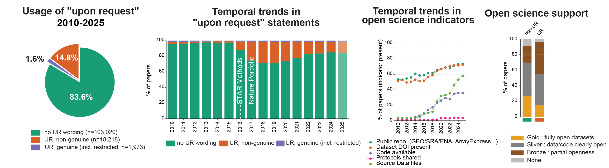

# Upon Request

  

This repository contains the code and data tables used to analyse the use of request based data availability statements such as “data available upon request” in the genomics, genetics, and bioinformatics literature between 2010 and 2025.

The analyses focus on how often such wording is used, how it has changed over time, and how it relates to other signals of open science support at the article and journal level.

## Overview

Using full text XML articles from PubMed Central Open Access, we detect and classify “upon request” statements and distinguish between vague formulations and cases linked to explicit access mechanisms or legitimate restrictions. In parallel, we extract multiple indicators of open science practices, including data deposition, code availability, protocol sharing, and source data provision.

The repository accompanies a policy and meta research analysis and is intended to support transparency, reproducibility, and independent auditing.

## General content

- Scripts for metadata retrieval, XML parsing, and text mining  
- Rule based classification of request based availability statements  
- Extraction and scoring of open science support indicators  
- Small derived tables and reference files stored in `2.data/`  

Large datasets and full text XML corpora are not hosted on GitHub.

## Folder contents

- `0.config/`  
  Configuration files, including the conda environment file.

- `1.scripts/`  
  Main analysis pipeline scripts, organised by step:
  - `00_setup/`
  - `01_metadata/`
  - `02_filter/`
  - `03_download/`
  - `04_qc/`
  - `05_upon_request/`
  - `06_open_science/`
  - `07_plots/` (notebooks)

- `2.data/`  
  Data tables used by the pipeline.  
  Note: this directory is empty [in Zenodo](URL).

- `3.xml/`  
  Placeholder for full-text JATS XML files (not hosted on GitHub, [in Zenodo](URL). Includes a short `README.txt`.

- `3.no_cc_code/`  
  Notes about code or components not redistributed. Includes a short `README.txt`.

- `4.analyses/`  
  Precomputed analysis outputs and figures (PDFs) used for the manuscript (for example journal-level plots and OSSI summaries), plus supporting subfolders.

## Notebooks

- [under_request_overview.ipynb](1.scripts/07_plots/under_request_overview.ipynb)  
  Summary analysis of the prevalence, classification, and temporal trends of “data available upon request” statements across journals and years.

- [open_science.ipynb](1.scripts/07_plots/open_science.ipynb)  
  Analysis of open science support indicators (OSSI).

## Data availability

Full text XML files and large derived datasets used for the analyses are archived separately on Zenodo.  
Links to the corresponding Zenodo records will be provided.

## Usage

To reproduce the analysis:

1. Clone the repository  
2. Install dependencies via conda using the provided `environment.yml`  
3. Place downloaded XML files and large datasets in the appropriate directories as documented  
4. Run the parsing and classification scripts in order  
5. Open the notebooks in `07_plots/` to regenerate figures

## Status

This repository reflects the analysis pipeline used for the associated manuscript.  
Minor updates and documentation improvements may occur, but the overall structure is stable.

## License

This project is released under the GNU General Public License v3.0.  
See the [LICENSE](LICENSE) file for details.

## Citation

If you use this code or derived analyses in academic work, please cite the associated manuscript.  
A [CITATION.cff](CITATION.cff) file will be added.
